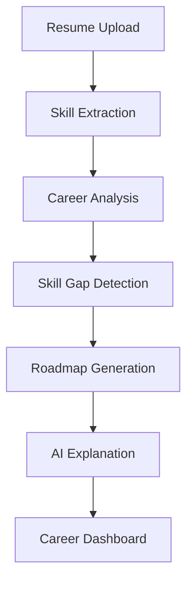
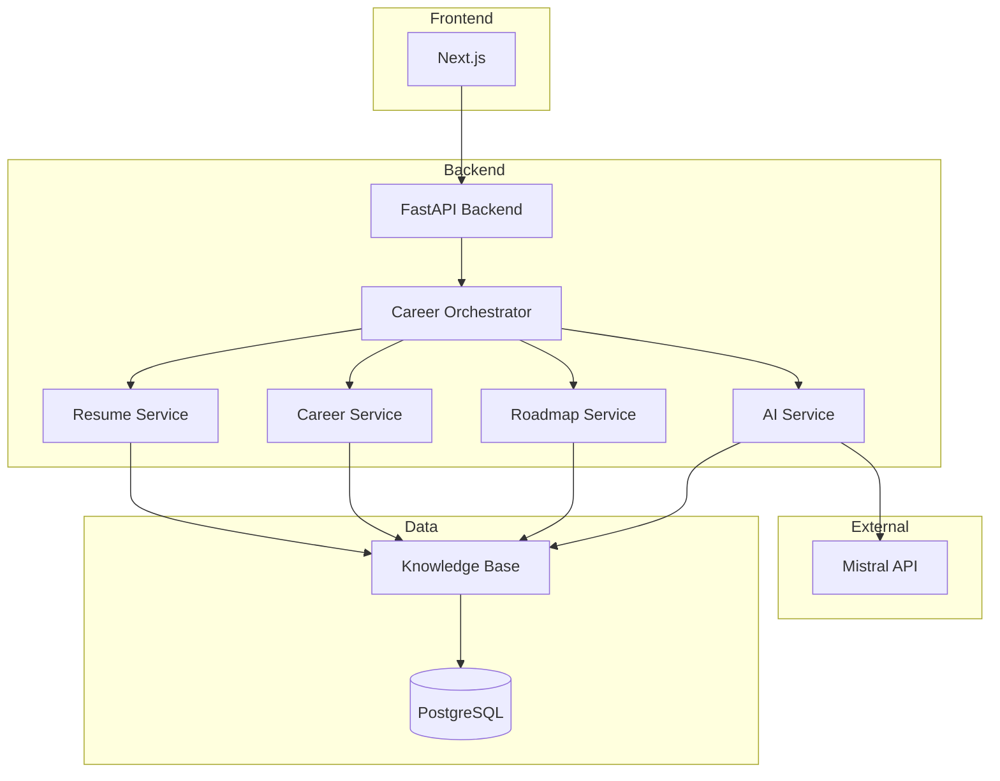
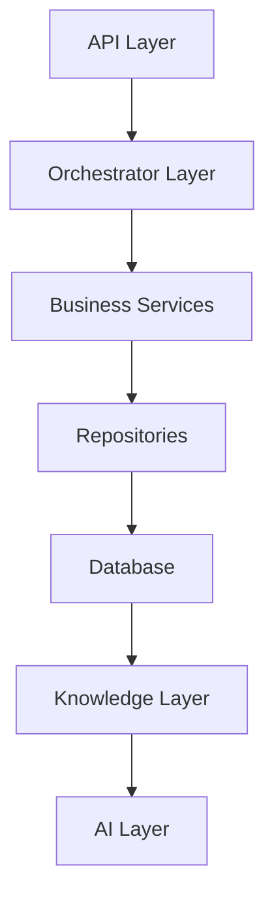
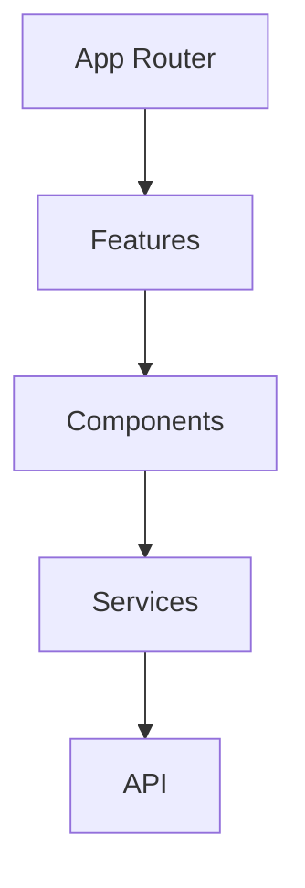
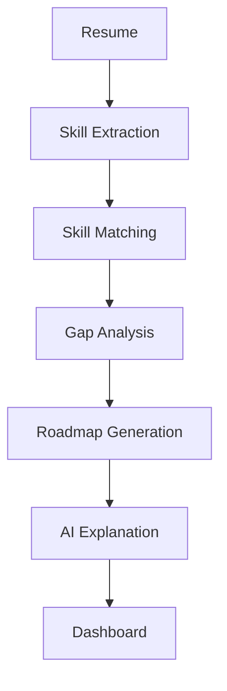

# CyberPath AI

> **AI-Powered Career Intelligence & Personalized Learning Platform for Cybersecurity**

**✨ Status: MVP Complete ✨**
The application is now fully integrated end-to-end. Static mock data has been purged, and the frontend is wired completely to a live FastAPI + PostgreSQL backend. The interactive Roadmap, Resume Analyzer, and AI Mentor operate on real user data and generative AI contexts.

[]()
[]()
[]()
[]()

---

# Table of Contents

1. Project Overview
2. Problem Statement
3. Solution
4. Features
5. Demo
6. System Architecture
7. Technology Stack
8. Repository Structure
9. Team & Responsibilities
10. Project Modules
11. Knowledge Base
12. Development Workflow
13. Installation
14. Configuration
15. Running the Project
16. API Overview
17. Database Design
18. AI Pipeline
19. Career Intelligence Engine
20. Development Roadmap
21. Coding Standards
22. Testing Strategy
23. Deployment
24. Security
25. Contributing
26. Documentation
27. License

---

# Project Overview

CyberPath AI is an intelligent career guidance platform designed specifically for cybersecurity learners.

Instead of providing generic roadmaps, the platform analyzes an individual's current knowledge, projects, certifications, and career goals to generate personalized learning paths, identify missing skills, recommend portfolio projects, and provide explainable AI guidance.

The system combines a structured cybersecurity knowledge base with an AI assistant powered by the Mistral API to deliver practical and personalized career recommendations.

---

# Problem Statement

Cybersecurity education is fragmented.

Learners often struggle to answer questions such as:

* Which cybersecurity role is right for me?
* Which skills do I already possess?
* What skills are missing?
* Which certifications are worth pursuing?
* Which projects should I build?
* How long will my learning journey take?

Most platforms provide static roadmaps that ignore an individual's existing knowledge and career aspirations.

---

# Solution

CyberPath AI provides:

* Resume Intelligence
* Career Readiness Assessment
* Skill Gap Analysis
* Personalized Learning Roadmaps
* AI Career Mentor
* Project Recommendations
* Certification Guidance
* Explainable AI Recommendations

---

# Key Features

## Resume Analysis

* PDF & DOCX Parsing
* Skill Extraction
* Project Detection
* Certification Recognition
* Experience Identification

## Career Intelligence

* Career Readiness Score
* Skill Matching
* Missing Skill Detection
* Learning Priority Ranking

## Personalized Roadmap

* Skill Dependency Resolution
* Weekly Study Planning
* Estimated Completion Timeline
* Practical Project Mapping

## AI Mentor

* Career Guidance
* Learning Explanations
* Resume Feedback
* Technology Recommendations

## Knowledge Base

* Cybersecurity Roles
* Skills
* Projects
* Certifications
* Learning Paths
* Tools
* Vendors
* Learning Resources

---

# Demo



---

# System Architecture



---

# Technology Stack

## Frontend

* Next.js
* React
* TypeScript
* Tailwind CSS

## Backend

* FastAPI
* SQLAlchemy
* Pydantic
* Python 3.12

## Database

* PostgreSQL

## Artificial Intelligence

* Mistral API

## Infrastructure

* Docker
* GitHub
* GitHub Actions

---

# Repository Structure

```text
assets/
backend/
frontend/
knowledge/
docs/
scripts/
```

Each major directory contains its own README explaining its purpose and internal structure.

---

# Team

## Shrovan

Role

Backend Architect

Responsibilities

* Backend Architecture
* API Design
* Database Design
* Repository Management
* System Integration

---

## Jaishree

Role

Backend Developer

Responsibilities

* Career Intelligence Engine
* Skill Matching
* Roadmap Generator
* Knowledge Loader

---

## Darshan

Role

AI Engineer

Responsibilities

* Mistral Integration
* Prompt Engineering
* Resume Intelligence
* AI Mentor
* Explainable AI

---

## Aathira

Role

Frontend Engineer

Responsibilities

* Dashboard
* Landing Page
* Resume Upload
* Roadmap UI
* Career Visualization
* API Integration

---

# Project Modules

Backend

* Authentication (Future)
* Resume Parser
* Career Engine
* Roadmap Engine
* AI Engine
* Knowledge Loader

Frontend

* Landing Page
* Dashboard
* Resume Upload
* Mentor Chat
* Roadmap
* Career Explorer

Knowledge

* Roles
* Skills
* Projects
* Certifications
* Learning Paths
* Vendors
* Toolkits
* Resources

---

# Knowledge Base Architecture

roles/

skills/

projects/

certifications/

learning_paths/

toolkits/

vendors/

resources/

schemas/

versions/

---

# Backend Architecture



---

# Frontend Architecture



---

# Development Workflow


---

# Installation

Backend

```bash
cd backend
pip install -r requirements.txt
```

Frontend

```bash
cd frontend
npm install
```

---

# Environment Variables

DATABASE_URL=

MISTRAL_API_KEY=

SECRET_KEY=

---

# Running

Backend

```bash
uvicorn app.main:app --reload
```

Frontend

```bash
npm run dev
```

---

# API Overview

Career API

Resume API

Roadmap API

Mentor API

Knowledge API

Health API

---

# Database

Users

Assessments

Roadmaps

Chat History

Knowledge Cache

---

# AI Pipeline


---

# Career Intelligence Pipeline



---

# Development Roadmap

## Phase 1

Repository

Documentation

Knowledge Base

## Phase 2

Backend

Career Engine

Resume Parser

## Phase 3

AI Integration

Frontend

Roadmap

## Phase 4

Testing

Optimization

Deployment

## Phase 5

Hackathon Demo

Presentation

Public Release

---

# Coding Standards

* Clean Architecture
* Feature Branch Workflow
* Type Safety
* Comprehensive Documentation
* Unit Testing
* Modular Design

---

# Testing Strategy

* Unit Tests
* Integration Tests
* API Tests
* Knowledge Validation
* Frontend Component Tests

---

# Deployment

Frontend

Vercel

Backend

Docker + FastAPI

Database

PostgreSQL

---

# Documentation

The `/docs` directory contains complete project documentation, including:

* Product Documentation
* System Architecture
* API Contracts
* Engineering Standards
* Research
* Technical Specifications
* Deployment Guides

---

# Security

* Environment Variables
* API Key Protection
* Input Validation
* Secure Dependency Management

Refer to `SECURITY.md` for additional details.

---

# Contributing

Please read `CONTRIBUTING.md` before submitting issues or pull requests.

---

# License

MIT License

See `LICENSE` for details.

---

# Acknowledgements

CyberPath AI is built to make cybersecurity education more structured, transparent, and personalized through the combination of domain knowledge, modern software engineering, and explainable artificial intelligence.
